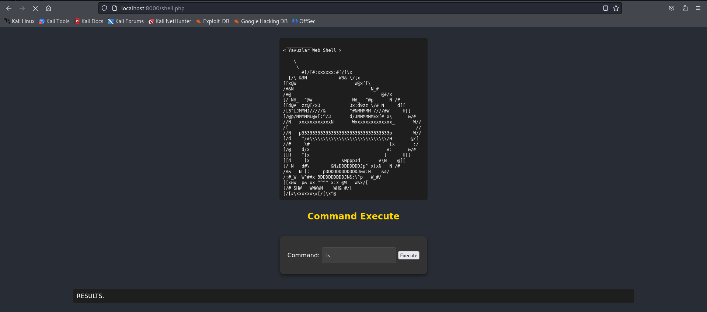
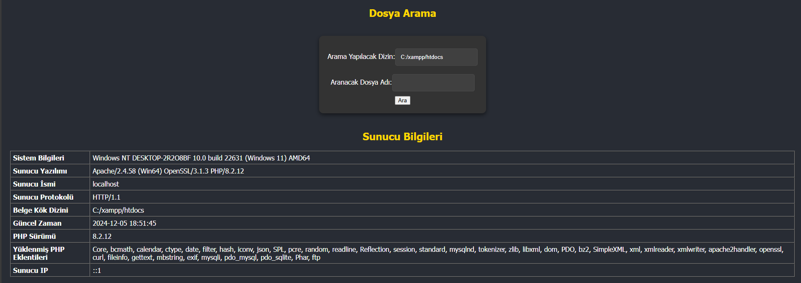

# Advanced-Php-Web-Shell

Yavuzlar Web Shell, temel komutları çalıştırabilmenizi, dosya yükleyip indirebilmenizi ve dosyaları yönetebilmenizi sağlayan bir PHP tabanlı web shell uygulamasıdır. 

## Özellikler

- Komut yürütme (help, ls, pwd, whoami, uname vb.)
- Dosya yükleme ve indirme
- Dosya düzenleme ve silme
- Dizin gezintisi ve dosya listeleme
- Dosya arama özelliği

### Giriş Yapma

-  Varsayılan şifre `123456`'dır.
  

### Komut Çalıştırma

- Giriş yaptıktan sonra terminal benzeri bir arayüz ile `ls`, `pwd`, `whoami` gibi komutları çalıştırabilirsiniz.
- Yardım almak için `help` komutunu çalıştırabilirsiniz.

#### 

### Dosya Yönetimi

- Dosya yüklemek için "Dosya Yükle" formunu kullanabilirsiniz.
- Mevcut dizindeki dosyaları görüntüleyebilir, silebilir veya düzenleyebilirsiniz.

#### 
** Detaylı Görünüm**  
İkinci görsel, belirli bir içeriğin detaylı görünümünü göstermektedir. Bu ekran, kullanıcıların daha fazla bilgi almak için bir görsele tıkladıklarında karşılaştıkları detay sayfasını yansıtmaktadır.

#### 

### Konfigürasyon dosyaları tespiti
Burada Konfigürasyon dosyaları tespitinde mevcut kodları değiştirerek özelleştirebilirsiniz.
- https://www.tecmint.com/check-configuration-files-linux/

#### 

### Kurulum

1. **Proje Dosyalarını İndirin:**
   

2. **Sunucuya Yükleyin:**
   

